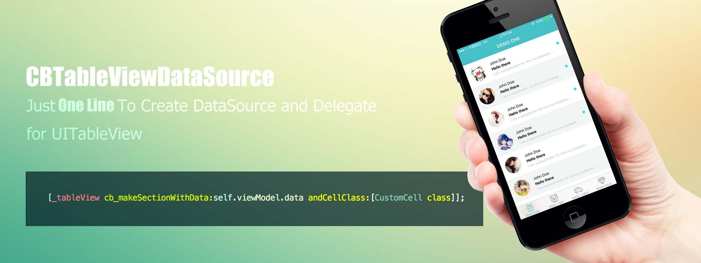

# CBTableViewDataSource 中文文档



只需一行代码，快速为`UITableView`创建`Delegate`和`DataSource`。

## 简介

`CBTableViewDataSource`是一个轻量级的用于快速创建`UITableView`的`DataSource`和`Delegate`的框架。它提供了一些方便的API，帮助用户以一种快速和有逻辑的方式创建`DataSource`和`Delegate`。

最偷懒的使用方式如下：

``` objective-c
[_tableView cb_makeSectionWithData:self.viewModel.data andCellClass:[CustomCell class]];
```
没错，只需要一行代码。当然，使用这种方式需要遵循一定的约定。与此同时，我也提供了其他一些灵活的使用方式。具体详情请阅读以下文档。

## 为什么使用
我们在开发App的时候，往往花费大量的时间在为`UITableView`写`DataSource`和`Delegate`上。而它们往往是一些重复性的并且难以维护的代码。因为它们分散在了各个代理方法中，当我们需要进行修改时，需要到各个代理方法中依次修改它们。

而`CBTableViewDataSource`改变了这种书写方式，它提供一套简练的API，使得我们可以快速地书写有逻辑的，便于维护的代码。

为了让大家看到使用该框架的优势，我们来做一个对比：

使用原生方式创建`DataSource`和`Delegate`:

``` objective-c

// Native vision

// define a enum to split section

typedef NS_ENUM(NSInteger, SectionNameDefine) {
    SECTION_ONE,
    SECTION_TWO,
    SECTION_THREE,
    SECTION_FOUR,
    //...
    COUNT_OF_STORE_SECTION
};

// define identifier for section

#define IDENTIFIER_ONE  @"IDENTIFIER_ONE"
#define IDENTIFIER_TWO  @"IDENTIFIER_TWO"
#define IDENTIFIER_THREE  @"IDENTIFIER_THREE"
#define IDENTIFIER_FOUR @"IDENTIFIER_FOUR"
//...


// register cell class for section

[self.tableView registerClass:[OneCell class] forCellWithReuseIdentifier:IDENTIFIER_ONE];
[self.tableView registerClass:[TwoCell class] forCellWithReuseIdentifier:IDENTIFIER_TWO];
[self.tableView registerClass:[ThreeCell class] forCellWithReuseIdentifier:IDENTIFIER_THREE];
[self.tableView registerClass:[FourCell class] forCellWithReuseIdentifier:IDENTIFIER_FOUR];


// implementation datasource protocol

- (NSInteger)numberOfSectionsInTableView:(UITableView *)tableView {
    return COUNT_OF_STORE_SECTION;
}

- (NSInteger)tableView:(UITableView *)tableView numberOfRowsInSection:(NSInteger)section {
    return ((NSArray*)self.data[section]).count;
}

- (UITableViewCell *)tableView:(UITableView *)tableView cellForRowAtIndexPath:(NSIndexPath *)indexPath {
    NSUInteger section = (NSUInteger) indexPath.section;
    NSUInteger index = (NSUInteger) indexPath.row;
    switch(section) {
        case SECTION_ONE:
        // to do something
            return cell;
        case SECTION_TWO:
        // to do something
            return cell;
        case SECTION_THREE:
        // to do something
            return cell;
            
            //...
    }
    
    return cell;
}
// ...

```
可以看到，步骤多而繁琐，维护十分困难。
而使用`CBTableViewDataSource`后

``` objective-c
[_tableView cb_makeDataSource:^(CBTableViewDataSourceMaker * make) {
    // section one
    [make makeSection:^(CBTableViewSectionMaker *section) {
        section.cell([OneCell class])
            .data(self.viewModel.oneDate)
            .adapter(^(OneCell * cell,id data,NSUInteger index){
                [cell configure:data];
            })
            .autoHeight();
    }];
    // section two
    [make makeSection:^(CBTableViewSectionMaker *section) {
        section.cell([TwoCell class])
            .data(self.viewModel.twoData)
            .adapter(^(FeedCell * cell,id data,NSUInteger index){
                [cell configure:data];
            })
            .autoHeight();
    }];

    // ... so on    
}];
```
代码变得简练而富有层次感，更加符合人类的思维方式。

## 用法

### 安装

使用`cocoapods`下载

``` ruby
pod 'CBTableViewDataSource'
```

### 导入包

``` objective-c
#import <CBTableViewDataSource/CBTableViewDataSource.h>
```

### 创建`DataSource`和`Delegate`

``` objective-c
[_tableView cb_makeDataSource:^(CBTableViewDataSourceMaker * make) {
    // section one
    [make makeSection:^(CBTableViewSectionMaker *section) {
        section.cell([OneCell class])
            .data(self.viewModel.oneDate)
            .adapter(^(OneCell * cell,id data,NSUInteger index){
                [cell configure:data];
            })
            .autoHeight();
    }];
    // section two
    [make makeSection:^(CBTableViewSectionMaker *section) {
        section.cell([TwoCell class])
            .data(self.viewModel.twoData)
            .adapter(^(FeedCell * cell,id data,NSUInteger index){
                [cell configure:data];
            })
            .autoHeight();
    }];

    // ... so on    
}];
```

## 例子
### 仅使用Data

``` objective-c
UITableView tableView = [UITableView new];
[tableView cb_makeSectionWithData:data];
```

使用该方式，Cell使用默认的`UITableViewCell`。

数据需要遵循以下约定：

1. data是一个字典数组（NSArray< NSDictionary* >*）
2. 字典键必须为以下5个键之一
    - `text`                映射为`UITableViewCell`的textLabel的文字.
    - `detail`              映射为`UITableViewCell`的detailTextLabel的文字
    - `value`               映射为`UITableViewCell`的detailTextLabel的文字
    - `image`               映射为`UITableViewCell`的imageView的图片
    - `accessoryType`       设置`UITableViewCell`右边的样式

其中detail和value均映射为`UITableViewCell`的detailTextLabel的文字，如果键为detail，则detailTextLabel显示在textLabel底下。如果键为value，则detailTextLabel显示在`cell`右边。两者只能出现一个，优先级以第一个出现在数组中为先。

例如：

``` objective-c
_data = @[
    @{@"text":@"Following",@"value":@"45"},
    @{@"text":@"Follower",@"value":@"10"},
    @{@"text":@"Star",@"value":@"234"},
    @{@"text":@"Setting",@"accessoryType":@(UITableViewCellAccessoryDisclosureIndicator)},
    @{@"text":@"Share",@"accessoryType":@(UITableViewCellAccessoryDisclosureIndicator)}];
```
则显示样式如下：


具体详情请下载该项目，查看`DemoTwoViewController.h`和`DemoTwoViewController.m`.

### 使用自定义Cell

``` objective-c
[tableView cb_makeSectionWithData:data andCellClass:[CustomCell class]];
```

使用该方式，CustomCell需要提供一个`Configuer:`方法或者`Configuer:index:`方法用于适配数据.

例如: 

``` objective-c
- (void)configure:(NSDictionary *)row index:(NSNumber * )index {
    if (row[@"avatar"]) {
        [self.avatarView setImage:[UIImage imageNamed:row[@"avatar"]]];
    } else {
        [self.avatarView setImage:nil];
    }
    [self.nameLabel setText:row[@"name"]];
    [self.titleLabel setText:row[@"title"]];
    [self.detailLabel setText:row[@"detail"]];
    self.circleView.hidden = row[@"unread"] == nil;

    if([index intValue] &1) {
        self.contentView.backgroundColor = [UIColor colorWithRed:0.95 green:0.96 blue:0.96 alpha:1.00];
    } else {
        self.contentView.backgroundColor = [UIColor whiteColor];
    }
}
```
具体用法请查看项目中`CustomCell.h`和`CustomCell.m`文件
页面样式如下：


详情请查看项目中`DemoOneViewController.h`和`DemoOneViewController.m`文件。

### 更灵活的设置

``` objective-c
[tableView cb_makeSection:^(CBTableViewSectionMaker * section) {
	section.data(@[]);
	section.cell([CustomCell class]);
	section.adapter(^(CustomCell cell,id row,NSUInteger index) {
		cell.configure(row);
	});
	section.event(^() {
		// do something
	})
	// other setting
}];
```

这里展示的是单个section的情况。

#### CBTableViewSectionMaker对象支持设置以下属性：

**注意，这些设置都是针对单独的section设置的**

##### data 

设置`UITableView`所要展示的数据。参数是一个NSArray。
如下：

``` objective-c
section.data(@[@(goods1),@(goods2),...]);
```

##### cell

设置`UITableView`展示数据用的Cell Class。该Class会自动注册identifier，无需手动注册

如：

``` objective-c
section.cell([CustomCell class]);
```

##### adapter

用于适配`Cell`和`Data`，如:

``` objection-c
section.adapter(^(CustomCell * cell,id row,NSUInteger index) {
    [cell configure:row];
    // ...
});
```

##### event

设置点击cell的响应事件。如：

``` objective-c
section.event(^(NSUInteger index,id row) {
    CustomViewController * controller = [CustomViewController new];
    controller.viewModel.data = row;
    [self.navigationController pushViewController:controller animated:YES];
});
```

##### height

用于设置cell的高度。传一个固定的值。该高度只对该section有效。如：

``` objective-c
section.height(100);
```

##### autoHeight

设置自动动态计算cell高度。用于cell高度不一的场景。

``` objective-c
section.autoHeight();
```
该属性与height冲突，优先级是autoHeight > height。
也就是说当设置了autoHeight，则height失效，高度以autoHeight为准

##### headerTitle;

设置section的headerTitle。用法如：

``` objective-c
section.headerTitle("title");
```

##### footerTitle;

设置section的footerTitle。用法同上。

##### headerView;

设置section的Header View。用法如下：

``` objective-c
section.headerView(^(){
    UIView * headerView = [UIView alloc]initWithFrame:CGRectMake(0,0,320,40);
    // ...
    return headerView;
})
```
该属性与headerTitle冲突，当设置了headerView，以headerView为准。

##### footerView;

设置section的Footer View。用法同上
该属性与footerTitle冲突，当设置了footerView，以footerView为准。

### 多个section的情况

``` objective-c
[tableView cb_makeDataSource:^(CBTableViewDataSourceMaker * make) {
	[make headerView:^{
		return [HeaderView new];
	}];
	[make makeSection: ^(CBTableViewSectionMaker * section) {
		section.data(@[]);
		section.cell();
		section.adapter();
		section.event();
		// ... so on
	}];
	[make makeSection: ^(CBTableViewSectionMaker * section) {
		section.data(@[]);
		section.cell();
		section.adapter();
		section.event();
		// ... so on
	}];
	[make makeSection: ^(CBTableViewSectionMaker * section) {
		section.data(@[]);
		section.cell();
		section.adapter();
		section.event();
		// ... so on
	}];
	// .. so on
	[make footView:^{
		return [FooterView new];
	}];
}]
```

页面样式如下：


具体的代码请查看项目中`DemoThreeViewController.h`和`DemoThreeViewController.m`文件。

#### CBTableViewDataSourceMaker支持设置以下属性：
**注意这些属性都是针对整个UITableView**

##### makeSection
用于为UITableView添加一个section。用法如下：

``` objective-c
[tableView cb_makeDataSource:^(CBTableViewDataSourceMaker * make) {
	[make makeSection: ^(CBTableViewSectionMaker * section) {
	   // ...
	}
}]
```

##### height
为整个UITableView的Cell设置默认高度。用法如下：

``` objective-c
make.height(100);
```

该属性与CBTableViewSectionMaker设置的height和autoHeight冲突。优先级是autoHeight > height(section) > height(UITableView)

也就是说，当一个section设置了autoHeight，则以autoHeight为准，其他section未设置autoHeight，而设置了height（section），则以height（section）为准，如果两者都没有，则以height（UITableView）为准。height默认为40。

##### headerView
设置UITableView的tableHeaderView，注意与section的headerView的区别，一个UITableView只有一个tableHeaderView。用法如下：

``` objective-c
make.headerView(^(){
    UIView * headerView = [[UIView alloc]init];
    // ...
    return headerView;
});
```

##### footerView
设置UITableView的tableFooterView，同上。

##### commitEditing
设置UITableView的commitEditing代理方法，设置了该方法，则cell侧滑可以出现删除按钮。
可以在刚方法设置当cell处于编辑状态需要处理的事件。用法如下：

``` objective-c
 [make commitEditing:^(UITableView * tableView, UITableViewCellEditingStyle * editingStyle, NSIndexPath * indexPath) {
    // do somethings.                
}];
```

##### scrollViewDidScroll
设置UITableView的scrollViewDidScroll代理方法，当UITableView滚动时会调用该方法。
可以使用该方法处理UITableView的滚动事件。

````objective-c
[make scrollViewDidScroll:^(UIScrollView * scrollView) {
    // do somethings                
}];
````

## 鸣谢

感谢您的使用和支持。欢迎issue和pull request，我会在第一时间内处理。

在这个框架中，我参考了许多大神们设计的框架。比如API的设计就参考了著名的AutoLayout框架Masonry。而在动态计算cell的高度上，则参考了@forkingdog的UITableView-FDTemplateLayoutCell的做法。

感谢他们带给我的灵感。

如有任何问题需要第一时间得到回答，请加交流群：481987249。

